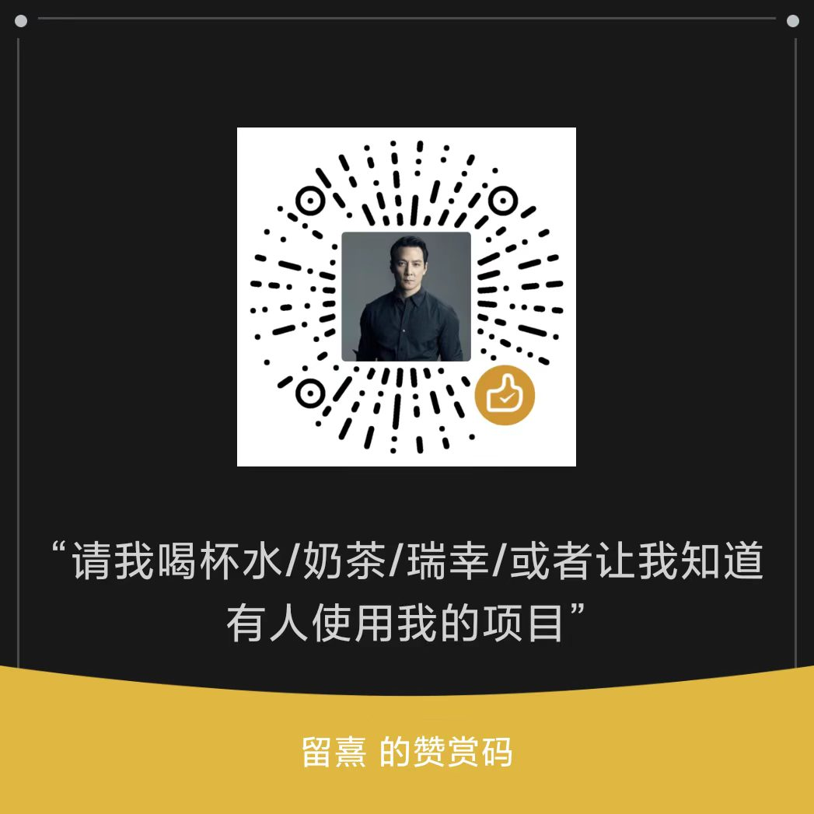

# op_wx_onebotv11

`op_wx_onebotv11` 是一个把 **官方 OpenClaw Weixin 私聊能力**整理成 **OneBot v11 接口** 的 TypeScript 库。

这个项目现在的目标比较克制：  
先把 **微信私聊登录、收消息、发文本/图片、OneBot HTTP / WebSocket 接口** 这条主链路做稳定，再慢慢补别的能力。

---

## 项目定位

这个库适合下面这类场景：

- 你想把微信私聊接进 OneBot v11 风格的上层框架
- 你只需要先跑通 **私聊文本和图片收发**
- 你可以接受目前能力范围比较小，不追求一次性把所有 OneBot 动作补全

它现在**不是**一个“全功能微信协议实现”，也不是一个“群聊能力完整覆盖”的项目。

---

## 当前已支持

- 二维码登录
- 微信私聊长轮询收消息
- OneBot v11 HTTP API
- OneBot v11 正向 WebSocket
- OneBot v11 反向 WebSocket
- `message.private` 事件
- `meta_event.lifecycle` / `meta_event.heartbeat`
- 文本消息发送
- 图片消息发送（本地路径、`file://`、HTTP(S)、`base64://`）
- 图片 / 语音 / 文件 / 视频接收
- 会话失效后可选自动扫码重登
- 可配置并持久化 OneBot 用户 ID 映射
- OneBot 消息段转换

---

## 当前暂不支持

- 视频 / 文件发送
- 语音发送（record outbound）
- 群聊相关 API / 事件
- 好友 / 群 / 群成员列表查询
- 撤回 / 合并转发 / 历史消息

---

## 安装

目前请直接拉源码使用：

```bash
git clone https://github.com/Lziu/op_wx_onebotv11.git
cd op_wx_onebotv11
npm install
```

---

## 快速开始

```ts
import { WeixinAdapter, OneBotV11Server } from "op-wx-onebotv11";

const adapter = new WeixinAdapter({
  storageDir: "./.data/op_wx_onebotv11",
  autoReloginOnExpire: true,
  userIdMapping: {
    prefix: "wx_user_",
    start: 1000,
    aliases: {
      alice: "o9cq80-xxxxx@im.wechat"
    }
  }
});

const qr = await adapter.startQrLogin();
console.log("qrcode url:", qr.qrcodeUrl);

await adapter.waitForQrLogin(qr.sessionKey, {
  printQrInTerminal: true
});

await adapter.start();

const server = new OneBotV11Server({
  adapter,
  accessToken: "change-me",
  http: { host: "127.0.0.1", port: 5700 },
  ws: { path: "/" },
  heartbeatIntervalMs: 15000
});

await server.start();
```

---

## 接口说明

### HTTP

默认动作入口：

- `POST /{action}`

例如：

- `POST /send_private_msg`
- `POST /get_login_info`

### 正向 WebSocket

支持三个入口：

- `/`：API + 事件混合
- `/api`：只处理 API
- `/event`：只推送事件

### 反向 WebSocket

支持通过配置主动连接上层 OneBot 服务端。

当前使用统一连接模式：

- Header 会带上 `X-Self-ID`
- Header 会带上 `X-Client-Role: Universal`
- 如果配置了 `accessToken`，会带 `Authorization: Bearer <token>`

---

## 已实现动作

- `send_private_msg`
- `send_msg`（仅 `message_type=private`）
- `get_login_info`
- `get_status`
- `get_version_info`
- `can_send_image`（当前返回 `true`）
- `can_send_record`
- `get_weixin_user_id_mappings`（扩展动作）
- `set_weixin_user_id_mapping`（扩展动作）
- `delete_weixin_user_id_mapping`（扩展动作）

---

## 一个最小配置示例

```ts
const server = new OneBotV11Server({
  adapter,
  accessToken: "change-me",
  http: {
    host: "127.0.0.1",
    port: 5700
  },
  ws: {
    path: "/"
  },
  reverseWs: {
    urls: ["ws://127.0.0.1:8080/onebot/v11/ws"]
  },
  heartbeatIntervalMs: 15000,
  messagePostFormat: "array"
});
```

---

## 设计上的几个说明

### 1. `self_id` / `user_id` 是字符串

这里不会强行把微信 ID 转成数字。

入站事件默认会把真实微信用户 ID 映射成稳定的 OneBot ID，例如：

- `wx_user_114514`
- `wx_user_114515`

`114514` 只是历史兼容默认起始值，不是微信或 OneBot 协议要求。可以通过 `userIdMapping.prefix`、`userIdMapping.start` 和 `userIdMapping.aliases` 自定义。上层程序回复消息时应直接使用事件中的 `user_id`，不需要读取映射文件。

运行时也可以设置自定义别名：

```json
{
  "action": "set_weixin_user_id_mapping",
  "params": {
    "user_id": "alice",
    "weixin_user_id": "o9cq80-xxxxx@im.wechat"
  }
}
```

`npm run smoke` 也可以通过环境变量配置：

```powershell
$env:OP_WX_USER_ID_PREFIX="contact_"
$env:OP_WX_USER_ID_START="1000"
$env:OP_WX_USER_ID_ALIASES='{"alice":"o9cq80-xxxxx@im.wechat"}'
npm run smoke
```

`OP_WX_USER_ID_ALIASES` 的键是 OneBot 对外 ID，值是真实微信用户 ID。

### 2. 字符串消息默认支持 CQ 解析

如果你传的是字符串消息，默认会按 CQ 码解析。  
如果要按纯文本发送，可以传：

```ts
auto_escape: true
```

### 3. 与官方最新版同步的基础行为

- 不手动设置 `Content-Length`，兼容 Node 24 的 `fetch`。
- 校验 `sendmessage` 的业务 `ret`，不再把 HTTP 200 的业务失败误报为成功。
- CDN 上传最多重试 3 次，4xx 不重试。
- 支持微信登录验证码、IDC 跳转和 `binded_redirect` 状态。
- 启停时发送 `notifystart` / `notifystop`，停止时中断长轮询。

---

## 目录结构

```txt
src/
  adapter/      微信适配层
  ilink/        官方接口相关实现
  onebot/       OneBot HTTP / WS 服务端
  storage/      本地状态存储
  types/        类型定义
  util/         日志等工具
```

---

## 开发命令

```bash
npm run typecheck
npm run build
npm run smoke
```

---

## 许可证

本项目使用 **PolyForm Noncommercial 1.0.0**，仅允许非商业用途。

---

### 赞助
<p align="center">
  
  
</p>
